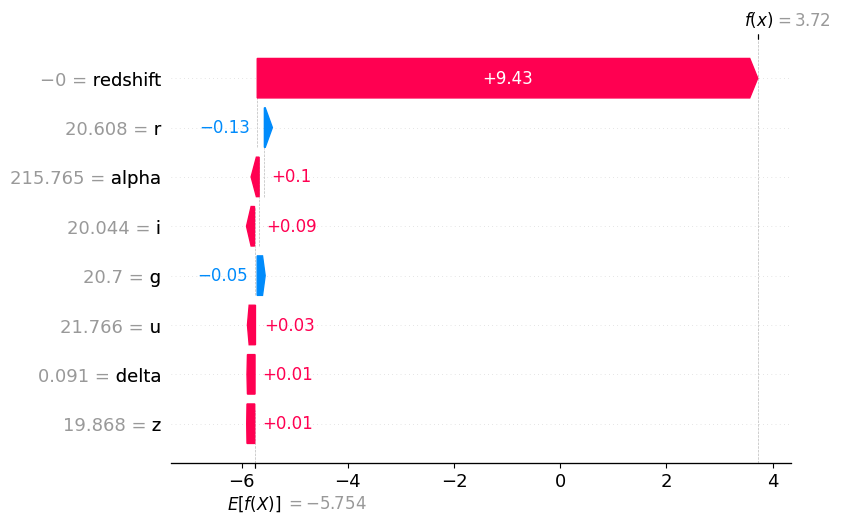
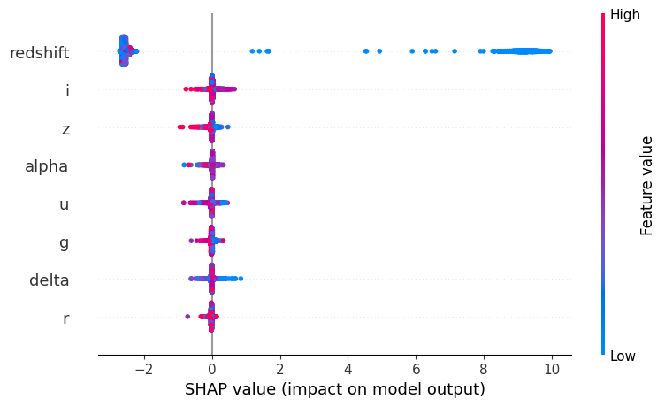
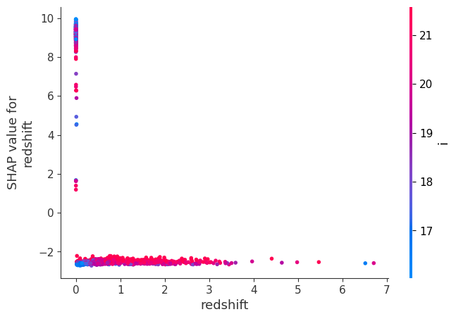
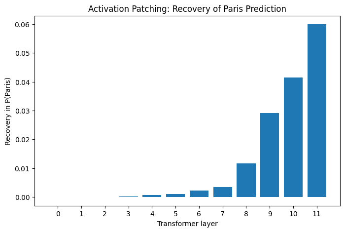

# From Post-hoc Explainability to Mechanistic Interpretability

This repository contains two hands-on experiments exploring how machine-learning models can be understood beyond their predictions.

## Project Overview

The project explores two complementary approaches:

1. **Post-hoc explainability** using SHAP on a LightGBM classifier trained on astronomical data.
2. **Mechanistic interpretability** using activation patching to investigate the causal role of internal representations in GPT-2.

---

## 1. SHAP-based Explainability

### SDSS17 Stellar Classification

A LightGBM classifier was trained on the SDSS17 stellar classification dataset.

- **100,000 astronomical objects**
- **8 input features:** alpha, delta, u, g, r, i, z, redshift
- **3 target classes:** GALAXY, QSO, STAR
- **80/20 train-test split**
- **Test accuracy:** 97.91%

The model was analyzed using SHAP to investigate how individual features contribute to predictions.

### Interpretability analysis

The analysis includes:

- Local SHAP explanations
- Global SHAP feature importance
- SHAP dependence analysis
- SHAP interaction values
- Comparison between SHAP importance and native LightGBM feature importance

The strongest feature in the model was redshift, while the photometric features contributed at smaller but measurable levels.

### SHAP visualizations

#### Local explanation



#### Global feature impact



#### Redshift dependence



---

## 2. Mechanistic Interpretability

### GPT-2 Activation Patching

The second experiment investigates the internal computations of GPT-2 using activation patching.

Two prompts were compared:

- **Clean:** “The Eiffel Tower is located in the city of”
- **Corrupted:** “The Colosseum is located in the city of”

For the clean prompt, GPT-2 assigned:

**P(Paris) = 0.063779**

For the corrupted prompt:

**P(Paris) = 0.003861**

Clean internal representations were then patched into the corrupted forward pass, one transformer layer at a time.

GPT-2 contains **12 transformer layers**, and the experiment measures how the probability of “Paris” changes after intervening on each layer.

The strongest recovery occurred in the later transformer layers. Patching the final layer recovered the clean probability:

**P(Paris) = 0.063779**

This provides a causal intervention-based view of model behavior, complementing the post-hoc SHAP analysis.

### Activation patching



---

## Key Conceptual Link

The two experiments investigate model understanding at different levels:

**SHAP**

> Which input features contribute to the model's output?

**Activation Patching**

> Which internal representations are causally involved in producing the model's output?

Together, they provide a progression from **post-hoc feature attribution** toward **causal analysis of internal model representations**.

---

## Repository Structure

```text
XAI_project.ipynb
XAI_project_2.ipynb

shap_waterfall.png
shap_summary.png
shap_dependence_redshift.png
activation_patching.png

README.md

figures/
├── shap_waterfall.png
├── shap_summary.png
├── shap_dependence_redshift.png
├── feature_importance_comparison.png
└── activation_patching.png
